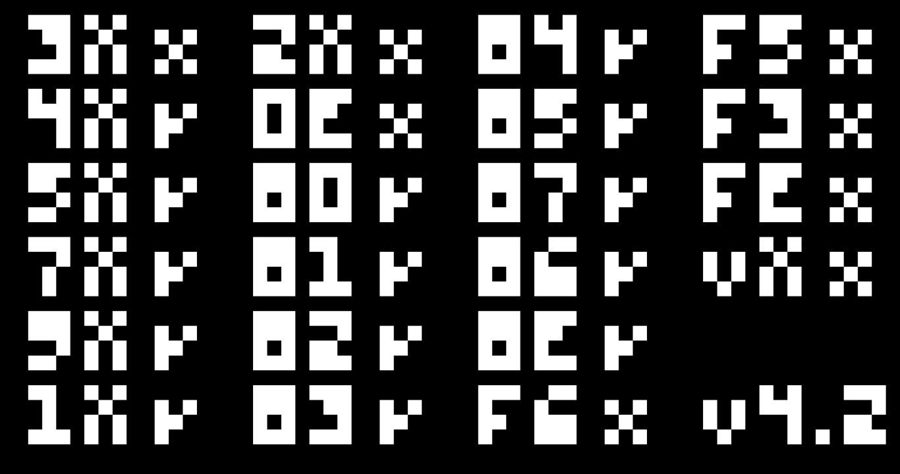

# EVA-8: A(nother) CHIP-8 emulator written in C.
A WIP Chip-8 emulator/interpreter.




## How to compile
You need to have SDL3 installed
  
  - Debian/APT
  ```
  sudo apt update
  sudo apt install libsdl3-dev   
  ```
  - Arch/Pacman
  ```
  sudo pacman -Syu sdl3
  ```
  
Clone this repo

  ```
  git clone https://github.com/selenelunii/eva-8.git
  cd eva-8
  ```
Compile 

  - Release

  ```
  make 
  ```
  
  - Debug
  
  ```
  make BUILD=debug
  ```
## Usage
Simply run it like this:
```
./eva-8 /path/to/rom
```
## About the project
It's my first programming project in general, i'm writting it in my spare time

## Status
It's only capable of running basic ROMs like the IBM logo ROM, it still does not have keyboard input or sound.

## Goals with this project
* Complete the chip8 emulator 
* Learn how to program an real project 
* Improve my english skills
